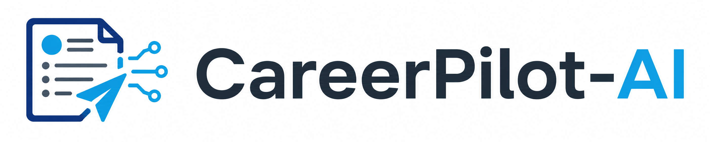

<div align="center">
  
  <p><strong>Agent-driven career workspace: JD-resume matching, trustworthy rewriting, RAG memory, and evaluation harness.</strong></p>
</div>

---

CareerPilot-AI is an LLM Agent-powered career workspace. Users upload a resume, paste a target JD, and the Agent automatically parses, matches, suggests trustworthy optimizations, and generates a STAR-format revised resume — all without fabricating experience. A RAG memory system accumulates user facts across analyses, and a hybrid retrieval pipeline (vector + BM25 + RRF) powers JD history search. Every component is backed by an evaluation harness.

## Highlights

- **Agent Workflow**: LangGraph state graph orchestrates JD parsing → resume parsing → rule scoring → LLM match analysis → integrity guard → report composition, with automatic degradation (Agent → single-shot LLM → rule engine).
- **Trustworthy Resume Rewriting**: STAR methodology with Result placeholders keyed to appropriate evaluation methods (RAGAS, JMeter, precision/recall). Never fabricates metrics — suggests where to measure and lets the user fill real numbers.
- **Integrity Guard**: Detects fabrication, exaggeration, and unsupported claims. Guard failures trigger LLM retry with feedback (max 2 rounds).
- **Post-Processing Corrector**: Five code-level rules fix common LLM mistakes — at-least-one logic, hallucinated gap removal, preferred-vs-required classification, GitHub detection, placeholder cleanup.
- **RAG Memory System**: Milvus Lite vector store (HNSW index, 1536-dim) + SQLite structured storage. Facts auto-extracted from every analysis. JD history retrievable via hybrid search.
- **Hybrid JD Retrieval**: Query rewriting (LLM) → multi-query (vector + BM25) → RRF fusion. 100% domain-level precision on 500-JD eval set.
- **Application Tracker**: CRUD with status history and cooldown detection.
- **Interview / Written-Test Review**: Record questions, weak points, and generate coaching suggestions.
- **Evaluation Harness**: 42 test cases across JD matching, integrity guard, prompt injection defense, and RAG retrieval.
- **Privacy-First**: Resume and job-search records are sensitive. No data leaves the user's machine without authorization.

## Architecture

```
┌──────────────────────────────────────────────┐
│               Frontend (Vue 3)               │
│  Login → Workspace → JD History              │
├──────────────────────────────────────────────┤
│             API Layer (FastAPI)               │
│  /auth/*  /analysis/*  /applications/*  ...  │
├──────────────────────────────────────────────┤
│          Agent Layer (LangGraph)              │
│  parse_jd → parse_resume → rule_match        │
│  → llm_analysis → integrity_guard → compose  │
│       ↓ failure                              │
│  single-shot LLM → rule engine                │
├──────────────────────────────────────────────┤
│        RAG Memory (Milvus + SQLite)           │
│  Index: JD text → embed → HNSW               │
│  Retrieval: query rewrite → vector + BM25     │
│           → RRF fusion → top-K                │
├──────────────────────────────────────────────┤
│           Data Layer (SQLite)                 │
│  8 tables: users, applications,              │
│  analysis_reports, interview_reviews,        │
│  written_test_reviews, user_facts,           │
│  jd_archive, application_status_history      │
└──────────────────────────────────────────────┘
```

## Repository Structure

```
CareerPilot-AI/
├── backend/
│   ├── app/
│   │   ├── main.py                  # FastAPI entry, CORS, exception handlers
│   │   ├── core/                    # config, database, security, errors, progress
│   │   ├── models/                  # SQLAlchemy models (8 tables)
│   │   ├── schemas/                 # Pydantic request/response
│   │   ├── api/v1/                  # REST routes
│   │   ├── services/                # business logic + post-processor
│   │   ├── agents/                  # LangGraph nodes, state, graph
│   │   ├── guards/                  # integrity, injection, grounding
│   │   ├── llm/                     # LLM client, prompts, schemas
│   │   ├── memory/                  # Milvus vector store, extractor, retriever
│   │   │   └── retrieval/           # query rewriter, hybrid retriever (BM25 + RRF)
│   │   └── utils/                   # file parser (PDF/DOCX)
│   ├── evals/                       # evaluation harness
│   │   ├── datasets/                # test cases (JD match, integrity, injection)
│   │   ├── runner.py                # eval runner
│   │   ├── ragas_eval.py            # RAG retrieval eval
│   │   └── retrieval_eval.py        # vector recall eval
│   └── requirements.txt
├── frontend/
│   └── src/
│       ├── api/                     # Axios client + API functions
│       ├── stores/                  # Pinia stores (auth, analysis, ...)
│       ├── components/workspace/    # workspace sub-panels
│       └── views/                   # Workspace, Login, Register, JDHistory
├── docs/                            # PRD, TRD, scope docs
└── README.md
```

## Getting Started

### Backend

```bash
cd backend
cp .env.example .env    # edit .env with your API key
pip install -r requirements.txt
uvicorn app.main:app --host 0.0.0.0 --port 8001 --reload
```

### Frontend

```bash
cd frontend
npm install
npm run dev
```

Frontend served at http://localhost:5173.

## API Overview

| Method | Path | Description |
|--------|------|-------------|
| POST | `/api/v1/auth/register` | Register new user |
| POST | `/api/v1/auth/login` | Login |
| GET | `/api/v1/auth/me` | Current user info |
| POST | `/api/v1/analysis/jd-match` | Agent JD-resume matching |
| POST | `/api/v1/analysis/rewrite-resume` | STAR-format resume rewrite |
| POST | `/api/v1/analysis/parse-resume` | Upload PDF/DOCX resume |
| GET | `/api/v1/analysis/jd-history` | Search archived JDs (hybrid retrieval) |
| GET | `/api/v1/analysis/reports` | Historical analysis reports |
| GET | `/api/v1/analysis/export-md/{id}` | Export revised resume as Markdown |
| GET | `/api/v1/analysis/export-pdf/{id}` | Export revised resume as PDF |
| GET | `/api/v1/analysis/progress/{sid}` | Real-time analysis progress |
| GET | `/api/v1/analysis/user-profile` | Aggregated memory profile |
| GET | `/api/v1/analysis/user-facts` | List extracted facts |
| DELETE | `/api/v1/analysis/user-facts/{id}` | Delete a fact |
| CRUD | `/api/v1/applications` | Application tracker |
| POST/GET | `/api/v1/interviews/reviews` | Interview reviews |
| POST/GET | `/api/v1/written-tests/reviews` | Written-test reviews |
| GET | `/api/v1/skill-profile` | Aggregated skill profile |

## Evaluation

```bash
# Full eval suite
cd backend && python -m evals.runner

# RAG retrieval eval
python -m evals.ragas_eval
```

| Suite | Cases | Key Metric |
|-------|-------|------------|
| JD Match | 7 | Score accuracy vs expected range |
| Integrity Guard | 5 | Fabrication/exaggeration detection |
| Injection Defense | 5 | 100% detection, 0% false positive |
| RAG Retrieval (6 JDs) | 5 queries | Precision@5: 100% |
| RAG Retrieval (500 JDs) | 20 queries | Domain precision: 100% |

## Key Design Decisions

- **Single Agent, not Multi-Agent**: All nodes in the analysis pipeline are serial dependencies. Multi-agent would add coordination overhead without parallelism benefits. A single LLM with role-switching prompts (advisor → reviewer → coach) achieves the same output quality with fewer calls.
- **Turbo for everything**: qwen-turbo provides sufficient quality for JD matching at ~3-5s per call. qwen-plus was 10x slower with marginal quality gains.
- **Resume rewriting is separate**: Decoupled from the main analysis flow. Users only trigger rewriting when the match score justifies it, saving ~40% analysis time.
- **HNSW over FLAT**: Milvus index acceleration for JD vector search.
- **RRF over single-method**: Reciprocal Rank Fusion merges vector and BM25 results better than either alone.

## License

Active development. Formal license to be added before public release.
